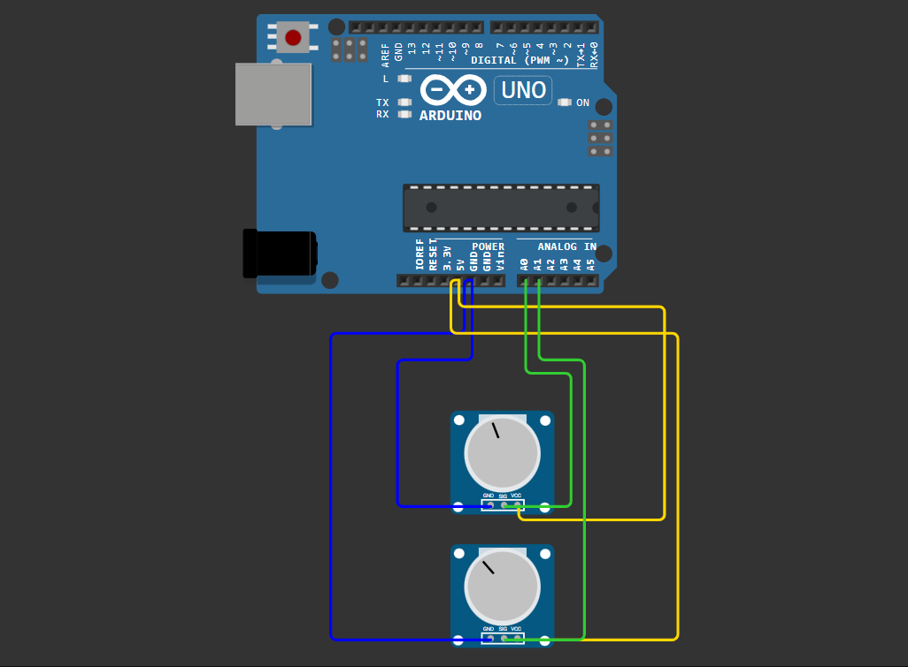

# Arduino-Based Hardware Mouse Controller

This project implements a low-latency, lightweight hardware mouse cursor positioning system using an Arduino Uno and a native C++ console application via the Win32 API (`windows.h`). 

The architecture is optimized for minimal resource usage by avoiding heavy high-level streams like `iostream` and relying strictly on standard C libraries and low-level Windows serial communication methods.

## 🚀 Features

* **Zero-Overhead Client:** Built entirely with `<stdio.h>` and native Windows handles, ensuring near-zero CPU and memory overhead during port polling.
* **Packet Framing Protocol:** Utilizes a custom Start-of-Frame (SOF) signature (`255`) to maintain absolute byte alignment and prevent synchronization drift.
* **Byte Stuffing / Data Escaping:** Prevents coordinate data collision by escaping raw data bytes that mimic the frame delimiter (`255 -> 254`).
* **Hardware Noise Filtering:** Implements a localized deadzone threshold on the microcontroller to eliminate signal jitter from the analog potentiometers.

## 🛠️ Project Structure

* `/arduino_ide` - Contains the microcontroller firmware (`.ino`) for polling analog inputs and packet serialization.
* `/cpp_console_code` - Contains the native Windows C++ source code responsible for serial reading and interfacing with the OS cursor.

## ⚙️ Communication Protocol & Architecture

The system communicates over a 9600 Baud rate serial line using a strictly defined 5-byte packet structure for every validated coordinate update:

`[ 255 (SOF) ] -> [ X_High_Byte ] -> [ X_Low_Byte ] -> [ Y_High_Byte ] -> [ Y_Low_Byte ]`

Coordinate transformation mappings convert the 10-bit hardware analog resolution (`0-1023`) directly into the software pixel coordinate space (`1920x1080`) using fixed-point integer mathematics to eliminate floating-point calculation latencies.

## 💻 Installation and Deployment

1. Upload the code inside `arduino_ide` folder to your Arduino.
2. Power up the potentiometers so that their signal pins connect to the `A0` and `A1` analog pins on the Arduino Uno.
3. Ensure the COM port identifier inside `cpp_console_code` matches your Arduino (Default: `\\\\.\\COM3`), compile and run the `cpp_console_code` file.

## Circuit Diagram

---

# Arduino Tabanlı Donanımsal Fare Kontrolcüsü

Bu proje, bir Arduino Uno ve Win32 API (`windows.h`) kullanan yerel bir C++ konsol uygulaması aracılığıyla düşük gecikmeli ve hafif bir donanım tabanlı imleç konumlandırma sistemi gerçekleştirir.

Mimari, `iostream` gibi yüksek seviyeli hantal akışlar yerine tamamen standart C kütüphanelerine ve alt seviye Windows seri iletişim yöntemlerine dayanarak minimum kaynak kullanımı için optimize edilmiştir.

## 🚀 Özellikler

* **Sıfır Yük (Zero-Overhead) İstemci:** Tamamen `<stdio.h>` ve yerel Windows handle yapıları ile oluşturulmuştur; port tarama işlemleri sırasında işlemci ve bellek yükünü sıfıra yakın tutar.
* **Paket Çerçeveleme Protokolü:** Mutlak byte hizalamasını korumak ve senkronizasyon kaymasını önlemek için özel bir Başlangıç Sınırlandırıcı (SOF) imzası (`255`) kullanır.
* **Byte Stuffing / Veri Kaçış Mekanizması:** Çerçeve sınırlandırıcı imzayı taklit eden ham koordinat verilerinin çakışmasını engellemek için veri byte'larını otomatik olarak kaçırır (`255 -> 254`).
* **Donanımsal Sinyal Filtreleme:** Analog potansiyometrelerden gelen sinyal titremelerini ortadan kaldırmak için mikrodenetleyici üzerinde yerelleştirilmiş bir eşik değeri (deadzone) uygular.

## 🛠️ Proje Yapısı

* `/arduino_ide` - Analog girişleri tarayan ve paket serileştirmesini gerçekleştiren mikrodenetleyici yazılımını (`.ino`) içerir.
* `/cpp_console_code` - Seri portu okuyan ve işletim sistemi imleci ile arayüz oluşturan yerel Windows C++ kaynak kodunu içerir.

## ⚙️ İletişim Protokolü ve Mimari

Sistem, doğrulanan her koordinat güncellemesi için kesin olarak tanımlanmış 5 byte'lık bir paket yapısı kullanarak 9600 Baud hızında bir seri hat üzerinden haberleşir:

`[ 255 (SOF) ] -> [ X_Tam_Sayı ] -> [ X_Mod_Değeri ] -> [ Y_Tam_Sayı ] -> [ Y_Mod_Değeri ]`

Koordinat dönüşüm eşlemeleri, ondalıklı sayı hesaplama gecikmelerini ortadan kaldırmak için doğrudan sabit noktalı tam sayı matematiği kullanarak 10-bitlik donanım analog çözünürlüğünü (`0-1023`) yazılım piksel koordinat alanına (`1920x1080`) dönüştürür.

## 💻 Kurulum ve Çalıştırma

1. `arduino_ide` klasöründeki kodu Arduino'nuza yükleyin.
2. Potansiyometrelere, sinyal bacakları arduino uno üzerindeki `A0` ve `A1` analog pinlerine gelicek şekilde güç verin.
3. `cpp_console_code` içindeki COM port adının Arduino'nuzla eşleştiğinden emin olun (Varsayılan: `\\\\.\\COM3`), `cpp_console_code` dosyasını derleyin ve çalıştırın.

## Devre Şeması / Circuit Diagram

